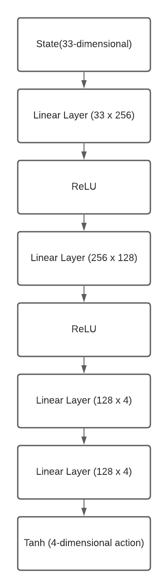
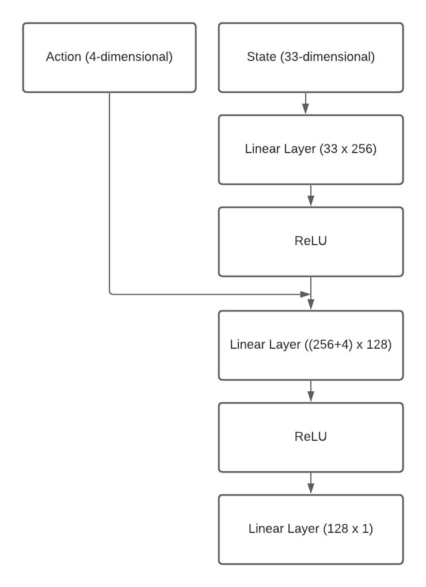
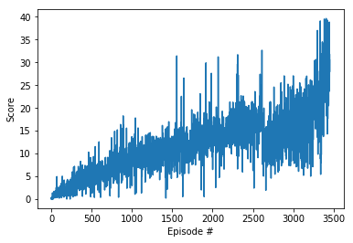

# Report

## Algorithm
The agent used to solve this project primarily makes use of [Deep Deterministic Policy Gradients (DDPG)](https://arxiv.org/abs/1509.02971), which falls in the Actor-Critic family of deep-reinforcement learning algorithms. Generally speaking Actor-Critic methods involve two neural networks learning together from the environment. The Actor network is responsible for direct policy approximation while the critic network is responsible for approximating the action-value function. In the case of the DDPG algorithm, the Actor network **directly regresses the continous action** and the Critic netork then uses this action and the state to approximate the action-value function by satisfying the Bellman Update Equation. In many ways, DDPG combines the best aspects of policy-based and value-based deep reinforcement learning methods. It directly approximates a policy while remaining highly sample efficient and being able to utilize experience replay (and in theory prioritized experience replay, although I did not use this variation).

**Please note that the code-skeleton for the DDPG agent and the network is taken from reference Udacity lessons: [ddpg-pendulum](https://github.com/udacity/deep-reinforcement-learning/tree/master/ddpg-pendulum) and [ddpg-bipedal](https://github.com/udacity/deep-reinforcement-learning/tree/master/ddpg-bipedal)**

### Custom Enhancements on top of Vanilla DDPG
* **Update Frequency**: Even though I have solved the single agent version of the environment, I followed the suggestion provided by the corresponding Udacity benchmark solution to update local networks every *20 timesteps*.
* **Number of updates**: Instead of just updating the networks once every 20 time steps, I update the network 10 times using differnt sets of minibatches sampled from the replay buffer. 
* **Clearing Replay Buffer and resetting agent state**: Once the agent is sufficiently close to the goal (reward of 17-20), I clear the replay memory and set the local and target networks to have the same weights as the local network and restart learning using a learning rate 1/10th the initial learning rate. Empirically, this helped dramatically accelerate learning. I discovered this approach by accident. When my notebook crashed once, I was foced to use the last saved checkpoint and resume training using a lower learning rate. I noticed that this dramatically accelerated the learning of the agent. As such, I incorporated this directly into the learning loop and retrained the agent. The reward graph linked further below shows that learning accelerates dramatically after these restarts. **It is worth noting though that this trick only works if the agent is close to the target reward.**

The enhancements above helped the agent come to a more stable solution. 


## Network Architectures
**The architecture of the Actor network is shown below:**

### Actor



**The architecture of the Critic network is shown below:**

### Critic



The architectures above were chosen after a *lot* of empirical testing to see what made the network learn. Most architectures failed to get past a score of 1. Counterintuitively, making the networks more complicated produced much worse results. The architecture is almost identical to that of [ddpg-pendulum](https://github.com/udacity/deep-reinforcement-learning/tree/master/ddpg-pendulum) with fewer parameters. 

## Hyperparameter Choice

The following is the list of hyperparameters of the DQN algorithm. *Most of the parameters were chosen by simple empirical experimentation to see what worked best with the problem.*

* Replay Buffer Size: This is the size of the actual replay buffer from which experiences are chosen to be replayed. I record (state, action, replay, next-state) tuples into this buffer till it reaches this size. Beyond this size, data is evicted in a FIFO fashion using a deque data structure. The size of the replay buffer for this problem was 100,000 based on empiricial testing. 
* Batch Size: This is the batch size used in the stochastic gradient descent update step. Based on empirical experimentation and the [ddpg-pendulum](https://github.com/udacity/deep-reinforcement-learning/tree/master/ddpg-pendulum) lesson, this was chosen to be 128. A larger batch size did not always produce better learning. 
* Gamma: This hyperparameter is used to discount rewards in an episodic task. The choice of gamma was 0.99 for this problem. This choice proved optimal for this problem.
* Tau: This hyperparameter controls how far behind the target Q-network is compared to the local Q-network. The udpates to target Q-network weights are according to the following equation: ```θ_target = τ*θ_local + (1 - τ)*θ_target```. This parameter was chosen to be 0.001 based on empirical testing.
* Actor Learning Rate: The learning rate of the Adam optimizer of the Actor network is chosen to be ```1e-4```. While larger learning rates worked for a while, during experimentation, they made the learning unstable where rewards would oscillate. 
* Critic Learning Rate: The learning rate of the Adam optimizer of the Critic network is chosen to be ```3e-4```. It is slightly higher than the learning rate of the Actor. The choice of these hyperparameters is from the [ddpg-bipedal](https://github.com/udacity/deep-reinforcement-learning/tree/master/ddpg-bipedal) lesson. 
* Weight Decay: Because the networks are so simple, I kept weight decay to 0.


## Training the Agent
With the choice of hyperparameters above and custom enhancements on top of DDPG mentioned above, the algorithm **trained the agent in 3452 episodes (The final agent exceeded an average score of 30 over 100 episodes).** The training graph is shown below. trainin



## Future Improvements
It is clear looking at the graph above that the agent trains **extremely slowly**. While I found one set of hyperparameters for this problem, I don't think these are the ideal set of hyperparameters. It should be possilbe to make the agent learn faster. One possible way to do so might be to use a **larger network with greater weight decay to regularize it and prevent it from becoming unstable**. Similarly, it may equally be possible to make use of **batch normalization layers** (although in my experiments, they counterintuitively hurt performance). 

